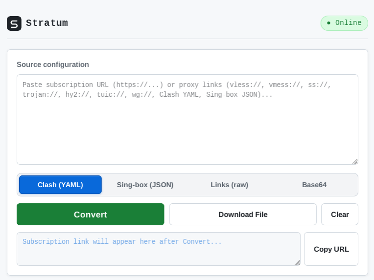

# Stratum

  

A Cloudflare Worker that converts proxy subscriptions between Clash / Mihomo
YAML, sing-box JSON, and raw share links. No database, no setup beyond one file.

Demo : https://stratum.ewzyw907x.workers.dev/

## Setup

1. Cloudflare dashboard → Workers & Pages → Create application → Start with Hello World! → Deploy.
2. Edit code: delete the template, paste all of `worker.js`, Deploy again.

## Use

Open the worker URL. Paste a subscription URL (or raw config text), pick a
format, press Convert. Put the generated link into your client
(Clash, Mihomo, v2rayNG, sing-box...).

- Your client shows the subscription name taken from the source URL.
- Refreshing the link always fetches the latest source — edits reach clients
  on their next update.
- Nothing is stored: the source travels inside the link itself, so longer
  sources make longer links.
